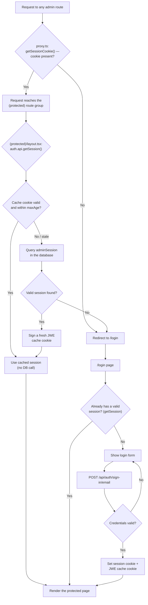

# Admin auth flow

How a request to any admin route gets authenticated, covering the proxy's
cheap cookie check, the `(protected)` layout's authoritative check, and the
session cookie cache in between.

Relevant files: `proxy.ts`, `app/(protected)/layout.tsx`, `app/login/page.tsx`,
`lib/auth.ts`.

## Why two checks

- **Proxy** (`getSessionCookie()`) only checks whether a cookie with the
  right name exists — no DB call, no validation. It exists purely to bounce
  the fully-anonymous case (no cookie at all) before any rendering happens.
  A forged cookie passes this check.
- **`(protected)/layout.tsx`** (`getSession()`) is the actual security
  boundary — it validates the session against the cache or, on a cache miss,
  the database. This is what catches a forged or expired cookie that got
  past the proxy.

## Why the cookie cache

`session.cookieCache` (`strategy: "jwe"` in `lib/auth.ts`) lets
`getSession()` skip the database on most requests by reading a short-lived,
encrypted snapshot of the session from a second cookie instead. It's
encrypted rather than just signed because the cached payload includes the
admin's user record (email, and potentially a `role` field later) — `jwe`
keeps that unreadable at rest, not just tamper-proof. Once the cache goes
stale, `getSession()` falls back to a real DB lookup and re-signs a fresh
cache cookie; this does **not** log the user out as long as the underlying
session is still valid in the database.
