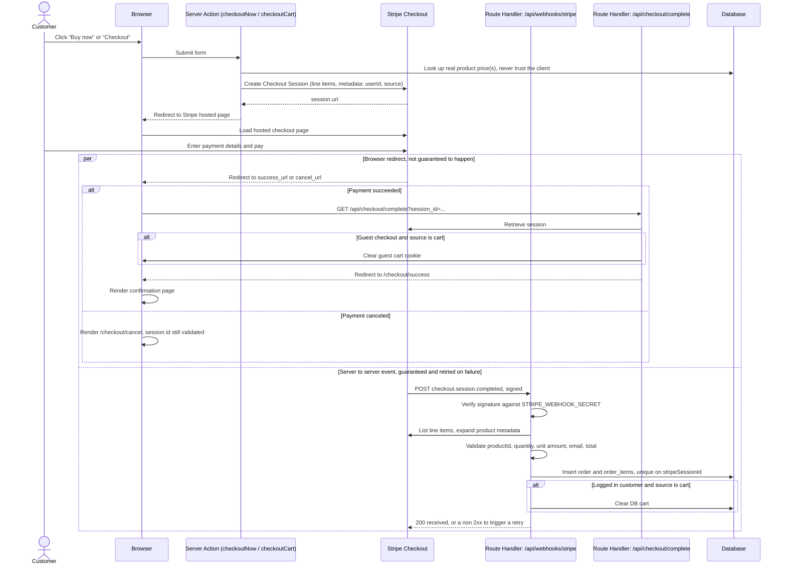
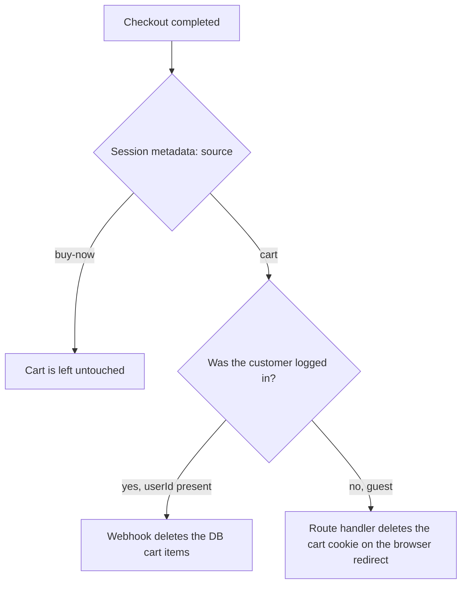

# Stripe Checkout Flow

This document describes how checkout works in ShopiNext: buying a single
product directly from its page, checking out a full cart, guest and
logged in customers, and how an order actually gets recorded after payment.

## Overview diagram

## Cart clearing decision

A single item bought through "Buy now" must never touch the cart. Only a
checkout that actually originated from the cart should empty it, and
where that emptying happens depends on whether the customer is a guest
or logged in.

## Explanation

### Two entry points, one session builder

Buying a single product from its page and checking out the whole cart are
the same underlying operation with different inputs, a list of
`{ productId, quantity }`. Both `checkoutNow` and `checkoutCart` in
`features/checkout/actions.ts` are Server Actions that funnel into one
shared `createCheckoutSession` function. Neither one ever trusts a price
coming from the browser, the price is always re-looked up from the
database at the moment the session is created.

### Why Stripe Checkout instead of a custom payment form

The app redirects to a Stripe hosted page rather than building a payment
form itself. No card data ever touches the server, there is no PCI scope
to worry about, and guest email collection is handled entirely by
Stripe's own page.

### The two completion paths are independent, and that is the whole point

Once payment finishes, two things happen that have nothing to do with
each other:

1. Stripe redirects the customer's browser back to the site. This is
   convenient for showing a confirmation page, but it is not reliable. A
   closed tab, a crashed browser, or a dropped connection right after
   paying means this redirect may simply never happen.
2. Stripe's own servers send a signed `checkout.session.completed` event
   directly to `/api/webhooks/stripe`, independent of the customer's
   browser. This delivery is retried automatically if the handler fails,
   for a window of a few days.

Because of that reliability gap, anything that must always happen, most
importantly creating the order in the database, lives in the webhook, not
in the browser facing route. The browser redirect path is only used for
things that are fine to skip if it never fires: showing a receipt style
page, and clearing a guest's cart cookie.

### Why the cookie clearing needed its own route

Cookies can only be written from a Server Action or a Route Handler, not
from a page's normal render. The success page is a plain Server
Component, so it cannot mutate cookies directly. `success_url` points at
`/api/checkout/complete`, a Route Handler that is allowed to write
cookies, which clears the guest cart cookie if needed and then redirects
on to the actual `/checkout/success` page, which stays a pure, read only
render.

### Idempotency

Stripe may redeliver the same webhook event more than once. `orders`
has a unique constraint on `stripeSessionId`, and `createOrder` in
`features/orders/queries.ts` uses `onConflictDoNothing` on that column,
so a redelivered event simply no ops instead of creating a duplicate
order.

### Validation instead of silent defaults

The webhook throws rather than defaulting to `0` or an empty string when
a line item, email, or total is unexpectedly missing. A thrown error
returns a non 2xx response, which Stripe interprets as "please retry."
Silently writing a zero amount or a blank contact email would corrupt
real financial data instead of giving anyone a chance to notice and fix
the underlying bug.

### Guest identity

`orders.userId` is nullable, and `orders.checkoutEmail` is always
populated from Stripe's own `customer_details.email`, independent of
whatever account email a logged in customer might have. In practice
Stripe locks that field once a `customer_email` is passed for a logged
in customer, so the two values end up matching there, but the design
keeps them as two separate concepts on purpose. A guest has no account
email at all, and `checkoutEmail` is the only contact channel that
exists for them.

### Known limitations

- `/api/checkout/complete` is an unauthenticated GET Route Handler with
  no CSRF protection, unlike Server Actions, which get an automatic
  Origin header check for free. Left unprotected on purpose, since the
  worst case is a stranger's guest cart cookie getting cleared, which
  is not worth guarding against.
- If a guest closes the tab before the redirect back to the site
  completes, their cart cookie never gets cleared, even though the
  order was still created successfully by the webhook. This is a known,
  accepted gap.
